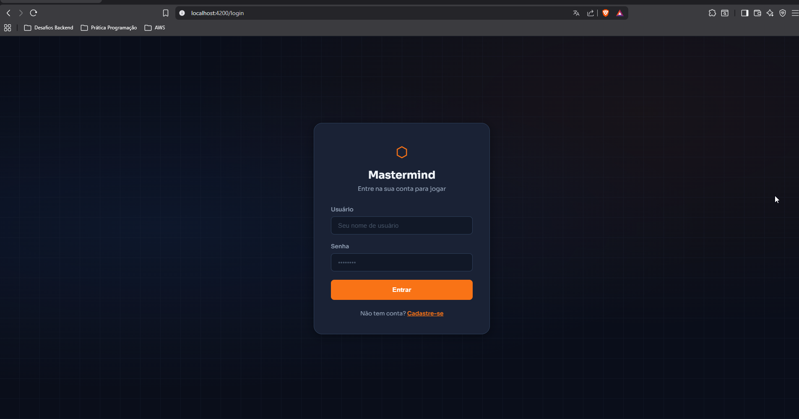
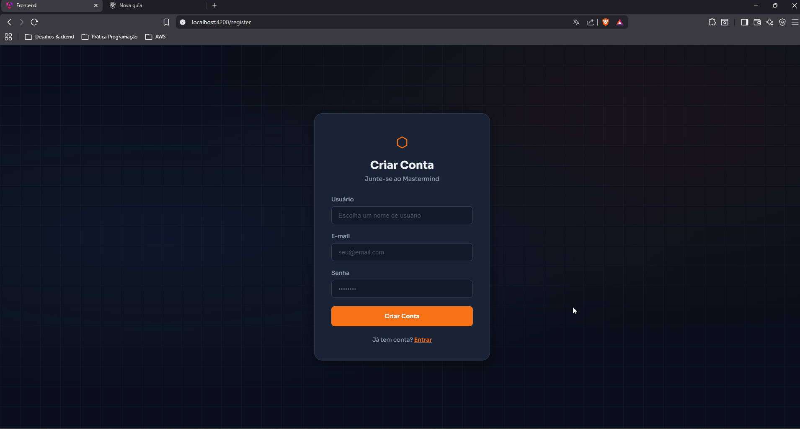
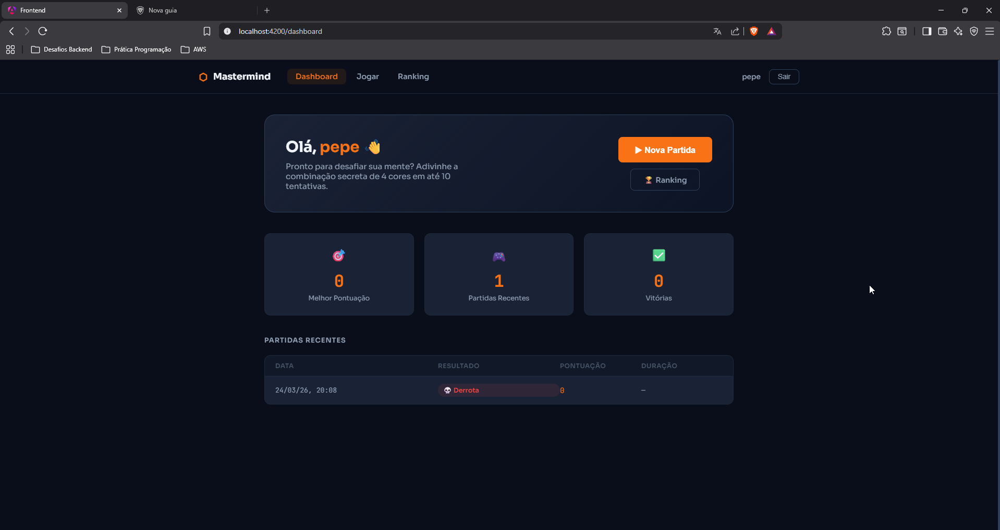
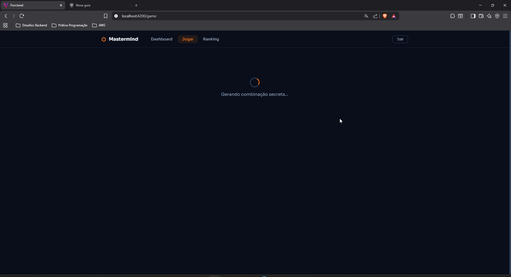
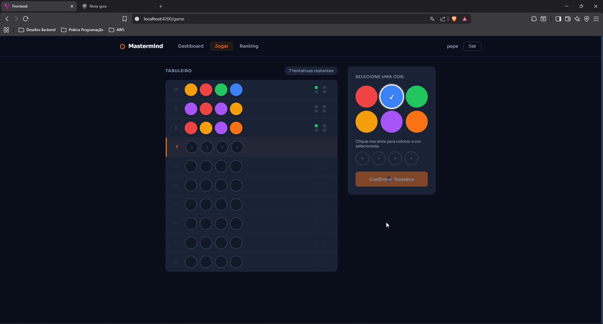
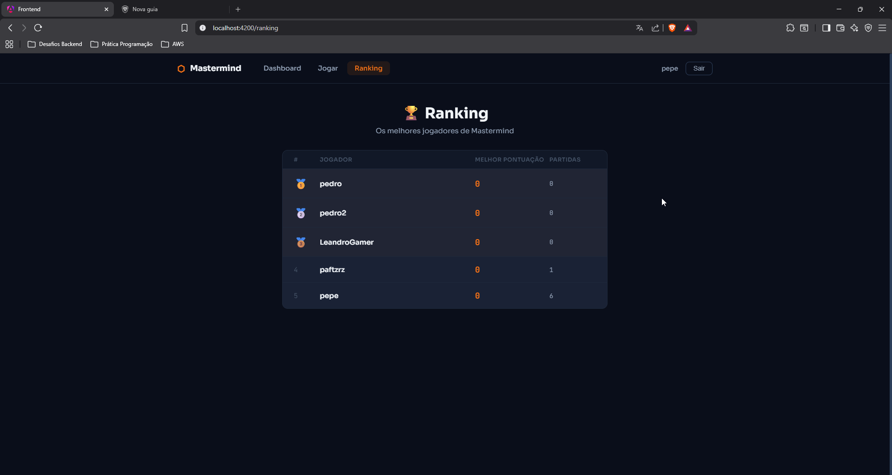
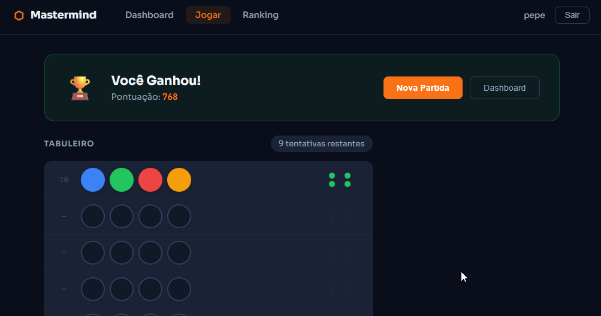
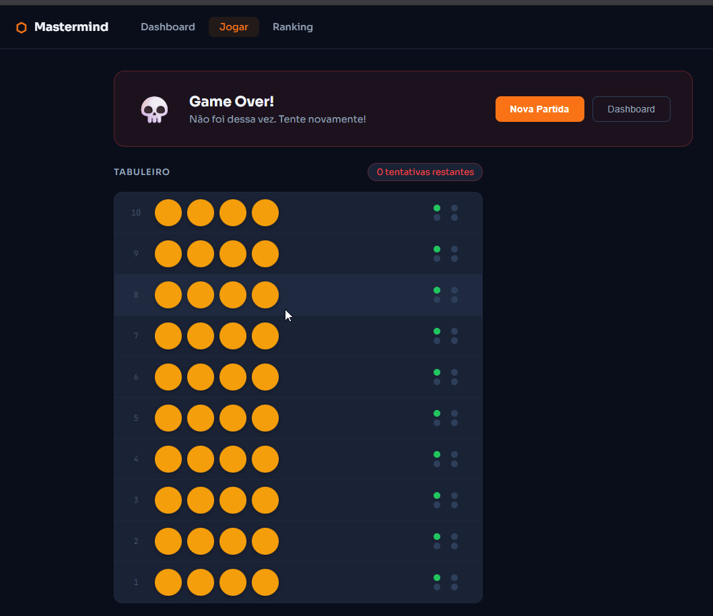
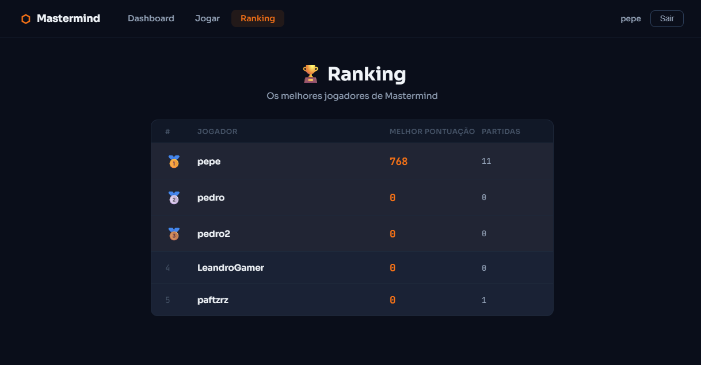

# Mastermind Game - Full-Stack Web Application

Jogo digital baseado no clássico **Mastermind**, desenvolvido como case técnico para a posição de Engenheiro Full-Stack Jr.

O jogador deve adivinhar uma combinação secreta de 4 cores em até 10 tentativas. A cada tentativa, o sistema fornece feedback indicando quantos acertos exatos foram obtidos.

## Decisões Técnicas

- **Backend**: Python com FastAPI — produtividade, tipagem nativa e documentação OpenAPI/Swagger automática
- **Frontend**: Angular 17 — componentes standalone, lazy loading e reactive forms
- **Banco de Dados**: SQLite — simples de configurar para execução local
- **Autenticação**: JWT (JSON Web Token) — stateless e seguro
- **Arquitetura Backend**: Controller → Service → Repository (SQLAlchemy ORM)
- **Arquitetura Frontend**: Componentes standalone com Services, Guards e Interceptors

## Pré-requisitos

- Python 3.10+
- Node.js 18+
- Angular CLI 17 (`npm install -g @angular/cli@17`)

## Como Rodar

### Backend
```bash
cd backend
python -m venv .venv
.venv\Scripts\activate  # Windows
source .venv/bin/activate  # Linux/Mac
python -m pip install -r requirements.txt
uvicorn app.main:app --reload --port 8000
```

O backend estará disponível em `http://localhost:8000`.  
A documentação da API (Swagger) estará disponível em `http://localhost:8000/docs`.

### Frontend
```bash
cd frontend
npm install
ng serve
```

O frontend estará disponível em `http://localhost:4200`.

## Variáveis de Ambiente

Consulte o arquivo `backend/.env.example`:

| Variável | Descrição | Valor Padrão |
|----------|-----------|--------------|
| `DATABASE_URL` | URL de conexão com o banco de dados | `sqlite:///./mastermind.db` |
| `SECRET_KEY` | Chave secreta para geração de JWT | *(deve ser configurado)* |

## Endpoints da API

### Autenticação
| Método | Endpoint | Descrição |
|--------|----------|-----------|
| POST | `/api/auth/register` | Registrar novo usuário |
| POST | `/api/auth/login` | Login (retorna JWT) |
| GET | `/api/auth/me` | Dados do usuário autenticado |

### Jogo
| Método | Endpoint | Descrição |
|--------|----------|-----------|
| POST | `/api/games/` | Iniciar nova partida |
| POST | `/api/games/{id}/attempts` | Submeter tentativa |
| GET | `/api/games/{id}` | Detalhes de uma partida |
| GET | `/api/games/` | Histórico de partidas |
| GET | `/api/games/ranking/top` | Ranking dos jogadores |

## Funcionalidades

- **Autenticação**: Login/Registro com validação de formulário e JWT
- **Dashboard**: Visão geral com partidas recentes e melhor pontuação
- **Jogo Mastermind**: Tabuleiro interativo com paleta de cores e feedback visual
- **Ranking**: Tabela ordenada por melhor pontuação com estatísticas
- **Responsivo**: Interface adaptável para diferentes tamanhos de tela
- **Tratamento de Erros**: Mensagens amigáveis ao usuário em todos os cenários

## Estrutura do Projeto
```
mastermind-game/
├── backend/
│   ├── app/
│   │   ├── main.py
│   │   ├── config.py
│   │   ├── database.py
│   │   ├── models.py
│   │   ├── schemas.py
│   │   ├── auth.py
│   │   ├── routes/
│   │   │   ├── auth_routes.py
│   │   │   └── game_routes.py
│   │   └── services/
│   │       ├── auth_service.py
│   │       └── game_service.py
│   ├── tests/
│   ├── requirements.txt
│   └── .env.example
└── frontend/
    └── src/
        └── app/
            ├── components/
            ├── guards/
            ├── interceptors/
            ├── models/
            ├── pages/
            └── services/
```


## Screenshots

### Login


### Register


### Dashboard


### Secret Game


### Jogo


### Ranking


### Win



### Lost


### Ranking Updated

